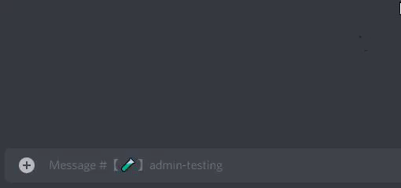

# Activities

Start Discord Activities with friends.

## Use

This requires the [MsgHook Plugin] to work.
To use it, join a voice channel and type `.activity <game>` in any text channel.
You'll send a link that can be used to start an activity.
Make sure to click the blue part of the link and not the "Play" button.

## Available Activities

| Activity              | Message                |
| :-------------------- | :--------------------- |
| YouTube               | `.activity youtube`    |
| YouTube (Development) | `.activity youtubedev` |
| Poker                 | `.activity poker`      |
| Betrayal.io           | `.activity betrayal`   |
| Fishing               | `.activity fishing`    |
| Chess                 | `.activity chess`      |
| Chess (Development)   | `.activity chessdev`   |
| Letter Tile           | `.activity lettertile` |
| Word Snack            | `.activity wordsnack`  |
| Doodle Crew           | `.activity doodlecrew` |

## Credits

The table of application ID's was taken from [discord-together] by RemyK888.
You can view its license [here](https://github.com/RemyK888/discord-together/blob/main/LICENSE).

[msghook plugin]: https://github.com/MysteryBlokHed/BetterDiscordPlugins/blob/master/plugins/MsgHook
[discord-together]: https://github.com/RemyK888/discord-together/blob/main/src/DiscordTogether.js
