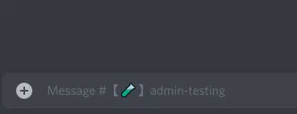

# MsgHook

Run code when messages are sent or edited.

## Use

The plugin creates a window variable called `MsgHook`.
You can add your own hooks with `window.MsgHook.addHook`:

```javascript
window.MsgHook.addHook((e) => {
  // your code here
})
```

The hook should return a string if the message was modified, and return nothing if it was not.

You can use `e.type` to check whether the message was newly sent or edited.
It will be `0` for a new message and `1` for an edited one.

### Types

Since this plugin is written in TypeScript, you can use the types with a triple-slash directive
in your own TypeScript plugin:

```typescript
/// <reference path="path/to/0MsgHook.plugin.ts" />
```

It's best to put this at the bottom so it doesn't interfere with the plugin metadata
expected at the top of the file.

This gives you better typing and in-editor documentation.

```typescript
/// <reference path="path/to/0MsgHook.plugin.ts" />
const MsgHook = (window as MsgHookWindow).MsgHook
MsgHook.addHook((e) => {
  return `${e.msg} - TypeScript hook!`
})
```

## Examples

### Say Hi

Here's an example hook that replaces the message content
when the message starts with `.sayhi`:

```javascript
window.MsgHook.addHook((e) => {
  // Check if message starts with '.sayhi'. If it does, get the message without it
  const msg = e.hasCommand('.sayhi')
  if (msg) return `Hello, ${msg}!`
})
```

Now, sending the message `.sayhi World` would change the message to `Hello, World!`

### Check for edit

Here's how you might run something when a message was edited:

```javascript
window.MsgHook.addHook((e) => {
  if (e.type === 1) {
    // Code for message edit goes here
  }
})
```

### Using message ids

To get the ids of a message, the `e.id` property is available.
It will either be a Promise that resolves to a string, or just a string.
It will only ever be a Promise for a newly sent message, and a string for an edited message.
A Promise is used for a new message because the id is only known after a response is received.

Here's an example that just logs the id of every message:

```javascript
window.MsgHook.addHook((e) => {
  // If the message is newly sent, ID will be available through a promise
  if (e.type === 0) e.id.then((id) => console.log('New Message Id:', id))
  // ID will be immediately available for an edited message since it's already known
  else console.log('Edited Message Id:', e.id)
})
```

### Check for change in already-hooked message

Here's a potential way to monitor when messages that had a hook run were edited:

```javascript
// Map ids to the hook run
const hooked = {}

window.MsgHook.addHook((e) => {
  const msg = e.hasCommand('.hooked')
  // Run either if the message starts with '.hooked' or the message was edited
  // and its id is in the hooked object
  if (msg || (e.type === 1 && hooked[e.id] == '.hooked')) {
    // Add id to hooked object when it's available
    if (msg) e.id.then((id) => (hooked[id] = '.hooked'))
    return `${msg ? msg : e.msg} - this message has been hooked`
  }
})
```

When a message is sent with `.hooked` at the start (eg. `.hooked example`),
it will have `- this message has been hooked` appended to the end.
When the message is edited again, even if `.hooked` is not at the beginning,
the text will still be appended.



#### Why is it `msg ? msg : e.msg` instead of just `msg`?

This is done because the result of `e.hasCommand`
is either a string without the command, or nothing.
If the string does not have the command, there's nothing to be removed,
so `e.msg` can be used directly instead.

### Accessing request headers

The headers of the request are also available as `e.headers`.
This can be useful if you need to use the user's authorization for another request,
such as to send an additional message or to edit another one.
Here's an example to log the Authorization header:

```javascript
window.MsgHook.addHook((e) => console.log(e.headers.Authorization))
```

### Block Letters

Here's a hook that converts letters to the `regional_indicator` versions
and digits to their emoji versions:

```javascript
window.MsgHook.addHook((e) => {
  const msg = e.hasCommand('.block')
  if (msg) {
    let newMsg = ''

    for (let char of msg) {
      if (char.match(/[A-Za-z]/)) {
        newMsg += `:regional_indicator_${char.toLowerCase()}: `
      } else if (char.match(/[0-9]/)) {
        switch (char) {
          case '0':
            newMsg += ':zero:'
            break
          case '1':
            newMsg += ':one:'
            break
          case '2':
            newMsg += ':two:'
            break
          case '3':
            newMsg += ':three:'
            break
          case '4':
            newMsg += ':four:'
            break
          case '5':
            newMsg += ':five:'
            break
          case '6':
            newMsg += ':six:'
            break
          case '7':
            newMsg += ':seven:'
            break
          case '8':
            newMsg += ':eight:'
            break
          case '9':
            newMsg += ':nine:'
            break
        }
      } else if (char == ' ') newMsg += '   '
      else newMsg += char
    }
    return newMsg
  }
})
```
